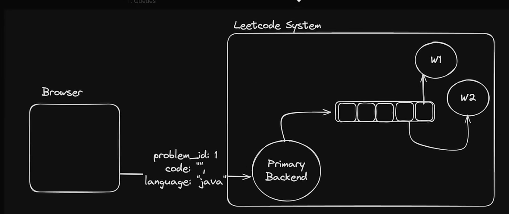

# Redis Implementation Project

This repository demonstrates a simple architecture integrating an
Express HTTP server with a background worker process. The components are
split into two independent TypeScript projects:

## 📁 Directory Structure

```
/ (root)
├── Architecture1.png         # System architecture diagram
├── leetcode.png              # Auxiliary screenshot/image
├── express server/           # TypeScript Express server
│   ├── package.json
│   ├── tsconfig.json
│   └── src/index.ts
└── worker/                   # TypeScript worker process
    ├── package.json
    ├── tsconfig.json
    └── src/index.ts
```

Each subproject compiles to a `dist/` directory and manages its own
dependencies. They can be run independently or together depending on
your use case.

## ⚙️ How to build & run

1. **Server**  
   ```bash
   cd "express server"
   npm install
   npm run build   # runs tsc -b
   npm start       # or node dist/index.js
   ```

2. **Worker**  
   ```bash
   cd worker
   npm install
   npm run build
   npm start
   ```

Adjust scripts in each `package.json` as needed.

## 📈 Architecture



## 🧩 Notes

- TypeScript configuration is isolated per component.
